# IPL Data Management

**IPL Data Management** is a relational database system which helps to store and retrieve **_Indian Premier League (Twenty20 cricket league that is annually held in India)_** data.  
**_Normalization techniques_** are applied on this relational database model to minimize the redundancy in the database tables.

## E-R Model

**Entity-Relationship model** for IPL database.
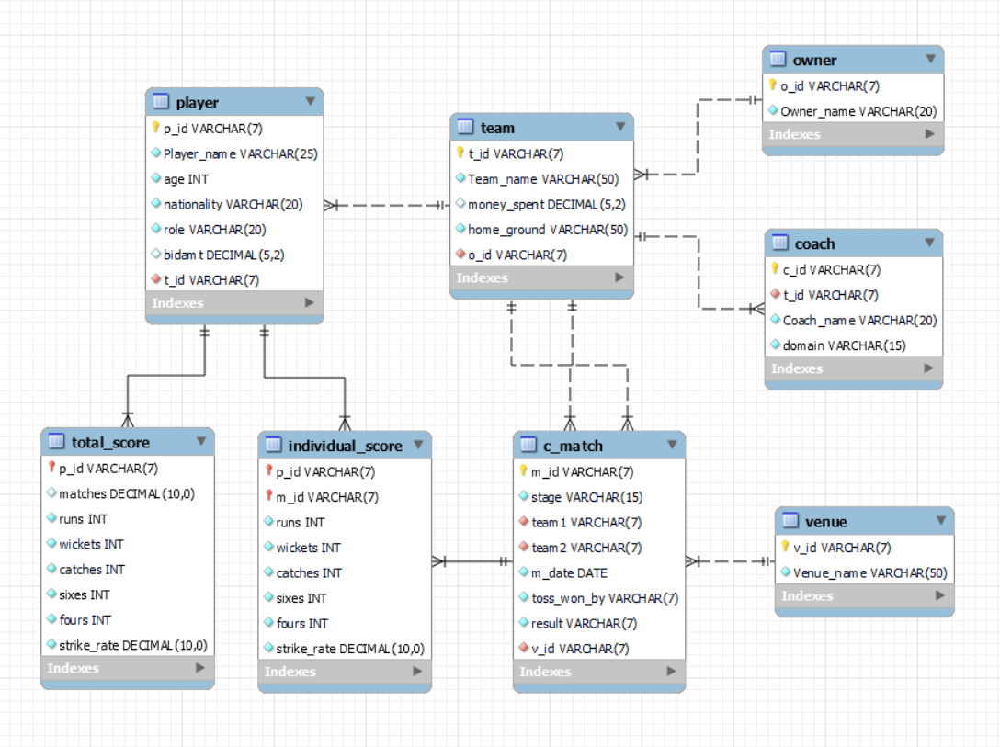

### Attribute symbols

## Commands

- docker compose --file mysql_server/docker-compose.yaml up --build --detach
- docker compose --file mysql_server/docker-compose.yaml down
- docker compose --file mysql_server/docker-compose.yaml logs --timestamps --follow

## Tools and Technologies Used

- MySQL Server
- MySQL Workbench
- MySQL Command Line Client
- MySQL query language

## Database Setup

- Run MySQL Server docker container.
- Open MySQL Workbench.
- Import and execute **ipl.sql** and **normalized_ipl.sql** files in MySQL Workbench.
- Play with **ipl** database.

## Project Explanation

IPL database contains 8 tables.

<!--- Use 2 SPACEs at the end of a line for line break(\n). -->

1. player  
   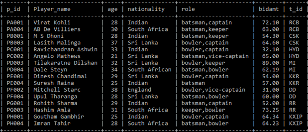
2. team  
   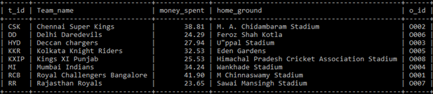
3. owner  
   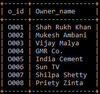
4. coach  
   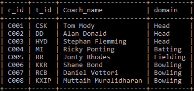
5. c_match (Current match)  
   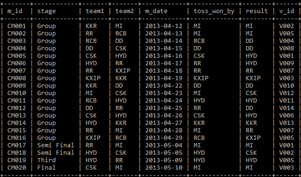
6. venue  
   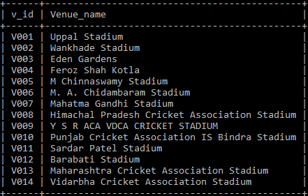
7. individual_score (A player's score in a perticular match)  
   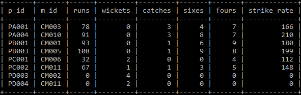
8. total_score (A player's total score in all the matches)  
   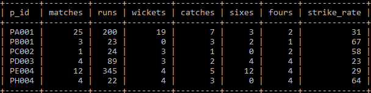

## Normalization

Normalization is the process of minimizing redundancy from a relation or set of relations in a database.

### First Normal Form (1NF)

_If the table is flat, i.e., no composite and multivalued attributes, then we say that the relation is in 1NF._

**player** table contains a multivalued attribute **role**. So **player** table is not in 1NF.

**_Conversion of player table to 1NF:_**  
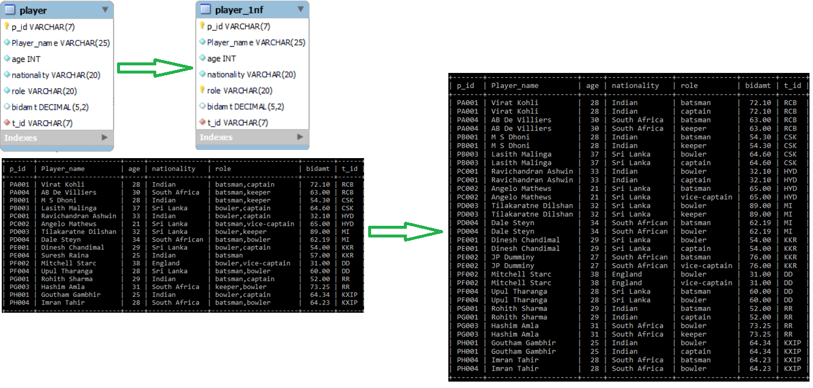

### Second Normal Form (2NF)

_A relation R is in 2NF if and only if:_

- _R is in 1NF_
- _There is no partial dependency of a non-prime attribute to any key of R._

**player_1nf** table has primary key **(p_id, role)**. But all the non-prime attributes of **player_1nf** table are partially dependent on **p_id**. So **player_1nf** table is not in 2NF.

**_Conversion of player_1nf table to 2NF:_**  
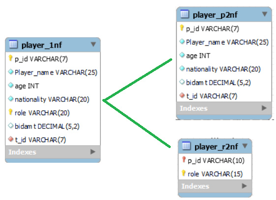

### Third Normal Form (3NF)

_A relation R is in 3NF if and only if:_

- _R is in 2NF_
- _In any functional dependency, there shouldn't be the case that a non-prime attribute is determinied(derived) by another non-prime attribute._

In **player_p2nf** table, non-prime attributes **(age, nationality)** are derived by the non-prime attribure **player_name**. So **player_p2nf** table is not in 3NF.

**_Conversion of player_p2nf table to 3NF:_**  
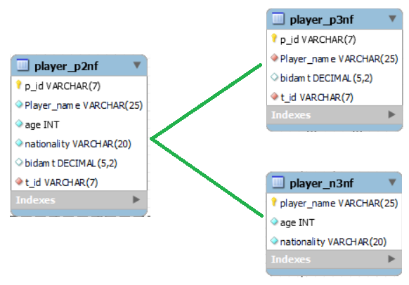

### Boyce-Codd Normal Form (BCNF)

_A relation R is in BCNF if and only if:_

- _R is in 3NF_
- _Whenever a non-trivial functional dependency, X --> A holds in R, then X should be a superkey of R. i.e., Determinants of all non-trivial functional dependencies must be superkeys._

Determinants of all the non-trivial functional dependencies in **player_p3nf** table are superkeys. So **player_p3nf** table is already in BCNF.

## Future Improvements

- **IPL** database system can be integrated with a web service so that user can easily interact with IPL data using web user interface.

## Learnings from this project

- Hands-on experience of working with MySQL Server, MySQL Workbench and MySQL Command Line Client.
- Designing efficient relational database model.
- Constraints of relational model such as domain, key, entity integrity and referential integrity constraints.
- Hands-on experience on SQL languages such as DDL, DML.
- Functional dependencies and lossless decomposition of tables based on normalization techniques.
- Understanding the usage and importance of indexing, B trees and B+ trees in relational database tables.

## References

- [MySQL official website](https://www.mysql.com/)

[Back To The Top](#ipl-data-management)
