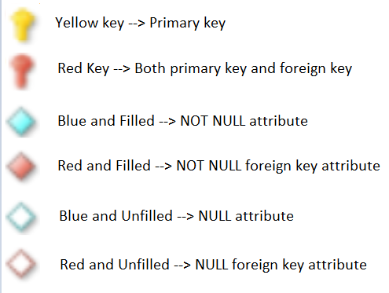

# IPL Data Management

**IPL Data Management** is a relational database system which helps to store and retrieve **_Indian Premier League (Twenty20 cricket league that is annually held in India)_** data.  
**_Normalization techniques_** are applied on this relational database model to minimize the redundancy in the database tables.

## E-R Model

**Entity-Relationship model** for IPL database.

### Attribute symbols

## Commands

- docker compose --file mysql_server/docker-compose.yaml up --build --detach
- docker compose --file mysql_server/docker-compose.yaml down
- docker compose --file mysql_server/docker-compose.yaml logs --timestamps --follow

